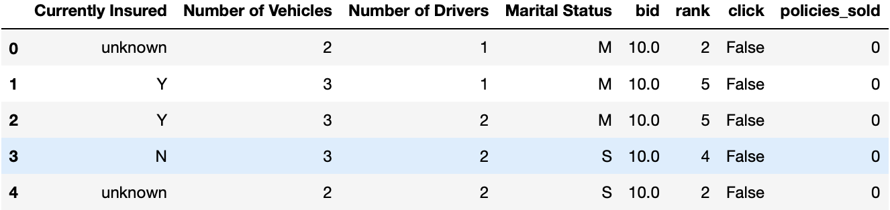
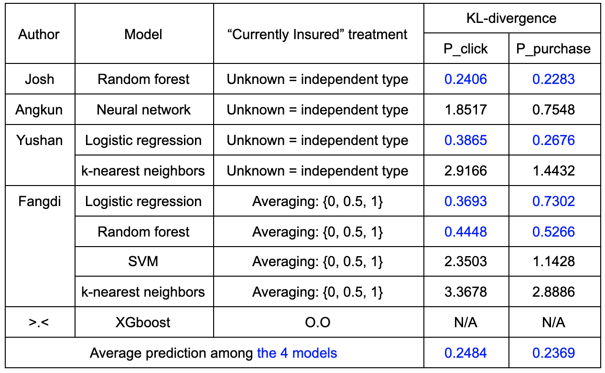
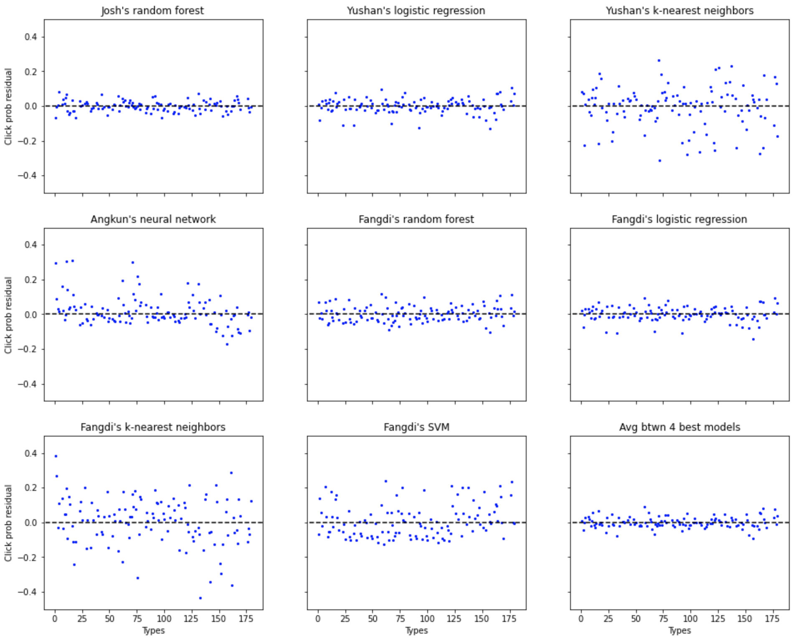
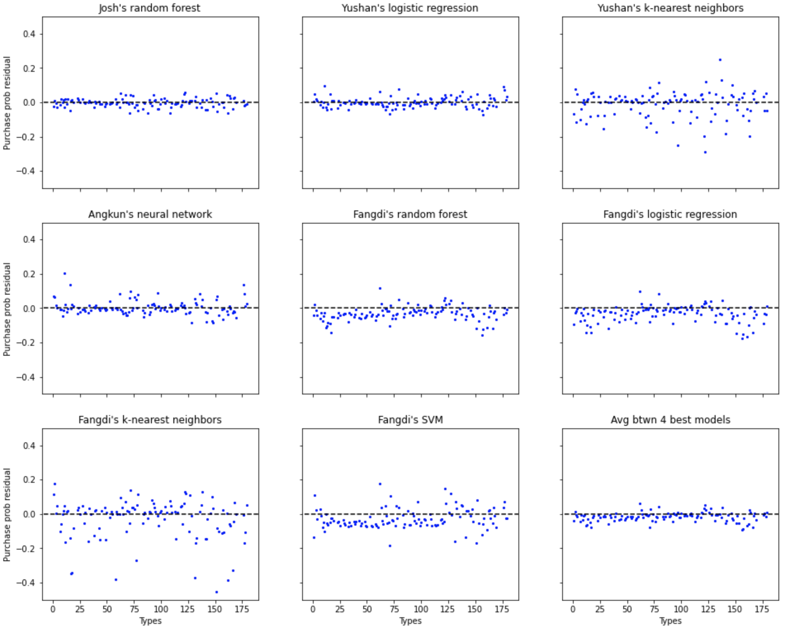
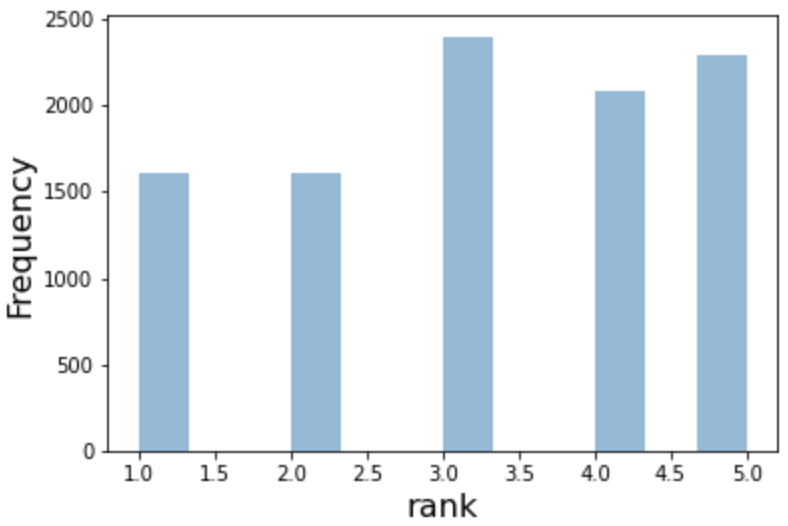
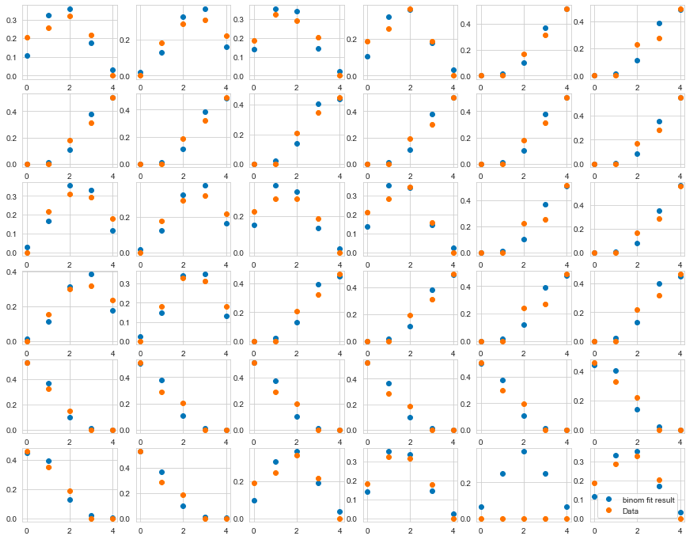

# Root Insurance Project -- Team Doodee
This is a Erdos data science Bootcamp project. We explore the dataset from insurance customers in a car insurance website. We'll try to evaluate different tyeps of customers and give different bid prices for different customers so as to show the insurance advertisement at a rank.

___
## Overview

- [Project description](#project-description)
- [Data Exploration](#data-exploration)
- [Machine learning approaches for probabilities](#machine-learning-approaches-for-probabilities)
- [Basic optimization method](#basic-optimization-method)
- [Binomial regression for rank distribution](#binomial-regression-for-rank-distribution)
- [Full optimization method](#full-optimization-method)
- [Authors](#authorship)

___
## Project Description

The goals of the project are:
- Understand the dataset: we have dataset with 10,000 "impressions" of ads, where the relation between customers and the insurance commercials hides.
- The marketing manager of the insurance company wants to understand how to bid differently for different customers so as to improve the ads performance.
- Bidding strategy: "optimize the cost per customer while having 4% customer rate over all ads shown". Bidding higher will make the ad to be shown higher in the ranking, but we do not know how the bidding change the ranking.
- Find some interesting relations for the website manager.

[Back to Overview](#overview)
___

## Data Exploration

We'll first explore how the dataset looks like and how the customers are featured.

</img>

There are four main features for each customers: `Currently Insured`, `Number of Vehicles`, `Number of Drivers` and `Marital Status`, each of which is a categorical predictor. In total, there are (3 `Currently Insured`) x (3 `Number of Vehicles`) x (2 `Number of Drivers`) x (2 `Marital Status`) = 36 possible combinations, i.e. types. However, we have data from only 35 types of customers. 

Furthermore, the `Currently Insured` feature contains 3 categories: `Y`, `N` and `unknown`. There are two possible interpretations of the `unknown` group that result in different treatments. First, we can interpret that `unknown` customers in fact belong to a distinct group; for example, they could voluntarily opt to not provide the information whether or not they already had an insurance when they entered the vertical search website. As a result, we should treat the `Currently Insured` feature as containing 3 saparate categories and use one-hot encoding to express the feature in terms of two dummy variables. On the other hand, we can interpret that any `unknown` customer is either a `Y` or `N` customer with the information missing, and hence they should be treated using an imputation process. This leads to the encoding of `Y` to 1, `N` to 0, and "unknown" to 0.5, so that the `unknown` is in a sense the average between `Y` and `N`.

For each customer in the data set, the bidding price is $10. The ultimate goal of this project is to determine the bidding price  for the 36 customer types, such that the advertisement spending per policy purchase is minimized subject to the constraint that the overall purchase rate is at least 4%. 

Finally, the `rank` at which our company's advertisement appears in the customer's vertical search channel is given for each customer. The `rank` is treated differently in each step of our project. In particular, our [models for click and purchase probability](#machine-learning-method-for-probability) treat `rank` as a categorical predictor, while our [model for rank distribution](#binomial-fit) treats `rank` as the target. More detail about the list of predictors and target(s) for each of our models is given in the corresponding sections for the models.

Since the total number of samples (10,000) is much larger than the number of unique features of customers (35), we expect that:
- 1). For each type of customer, there is a distribution of the ranks, , where i is the customer type and r=1,2,3,4,5 denote the rank; 
- 2). Given customer types and ranks, there is a probability, , for the customer to click on the advertisement;
- 3). Given customer types and ranks, there is a probability, , for the customer to purchase the insurance policy;

Items 2) and 3) imply that, given a clicked customer, there is also a conditional probability, , for the customer to purchase the insurance policy.

[Back to Overview](#overview)
___
## Machine Learning Approaches for Probabilities

As will be clear in a [later section](#gradient-descent), it is necessary for later steps in this project to know the probability that a customer will click on our insurance company advertisement and the probability that he/she will purchase the insurance company's policy, given the customer information and the ranking in which the advertisement is displayed. In short, we will construct models with features: `Currently Insured`, `Number of Vehicles`, `Number of Drivers`, `Marital Status` and `rank`. Each model will separately predict: `Probability of click` and `Probability of purchase`.

Although one can obtain these probabilities simply by counting the data, this is not an option for all types of customers in all ranks, as for some types of customers we do not have the data of those in all the ranks. For example, for uninsured, married customers with 3 vehicles and 2 drivers, we only have their data in ranks 3, 4 and 5. The need to fill in the blanks and predict the probabilities of click and purchase by customers of all types and ranks motivates us to construct a machine learning model to complete the task.

We explored various models to predict the probabilities. For each model, we considered the [two possible ways](#data-exploration) to encode the `Currently Insured` feature. The models in consideration include <a href="https://en.wikipedia.org/wiki/Random_forest">random forest,</a> <a href="https://en.wikipedia.org/wiki/Logistic_regression">logistic regression,</a> <a href="https://en.wikipedia.org/wiki/K-nearest_neighbors_algorithm">k-nearest neighbor,</a> <a href="https://en.wikipedia.org/wiki/Support-vector_machine">support-vector machine</a> and <a href="https://en.wikipedia.org/wiki/Neural_network">neural network.</a>  Each model is tuned using cross-validation on the training data set, while we set aside the test data set for final model selection. With the goal of predicting the probabilities rather than predicting the definite values of categorical targets, we utilize the metric of <a href="https://en.wikipedia.org/wiki/Kullback%E2%80%93Leibler_divergence">Kullback-Leibler divergence</a> (KL divergence) to quantify the accuracy of each model's probability predictions. In particular, we compute the KL divergence for the predicted click and purchase probabilities compared to those deduced from the data, for each combination of features for which the actual customer data are available. Then, we sum the statistic over all such feature combinations.

The KL divergence for each model is shown in the table below for the predicted probabilities of click and purchase. 

</img>

From the table, we see that the random forest and logistic regression for both treatments of the `Currently Insured` feature have the lowest KL divergence, which implies better matches with the probabilities deduced from the data. This is true for the predictions of both probabilities. Since the fifth-best model, neural network, has total KL-divergence of more than 4 times the fourth-best model for the click rate, while the top four models have similar KL divergences, we decide to proceed with the average probabilities predicted by the two random forest and two logistic regression models. As for the purchase rate, the top-five rankings are similar, but now neural network performs almost as good as the four best models. However, we still decide not to include neural network into our average model for purchase rate because it is a more flexible model, which should perform significantly better in order to justifies its inclusion by the principle of parsimony. Hence, we use the average of the four models written in blue to predict both probabilities. The last row of the table shows the KL divergence for the average model. 
 
 In order to illustrate how well each model fits the actual probabilities, we show their residual plots below. In each plot, the horizontal axis corresponds the various combinations of values of categorical predictors. The vertical axis is the probability deduced from counting the raw data minus that predicted by the model. Note that only the combinations of predictors with available data are plotted.

</img>

</img>

[Back to Overview](#overview)
___
## Basic Optimization Method

Statistically, we're not dealing with a classification problem but a probability problem, where the accuracy of prediction is not very important. However, from the perspective of the insurance company, we do want to invest more on the types of customers who are prone to buy the policy after click (Only clicked ads need to be paid). By investing more (bidding more), we could improve the rank of the ads and thus increase the click probability.

### Targets of the Problem

Notice that the probabilities are all conditioned, e.g. the probability of the 2nd-rank ads being clicked but not sold. Thus, in principle, we have a classification of 15 type (5 ranks, click and sold or not, no click). However, the samples are limitted for some targets to stratify. So a more suitable one to assume that the sold rate is independent once the customer click, then we only need to have 10 type of new targets.

##### However

How should we deal with the relation between bidding price and the ranking? We have no other info from the dataset, or we need to search for more supporting relations. For a naive model, we could adopt a **key assumption**:

`The overall buying probability of a particular type of clicked customers is independent of their ranking`

Afterall, the ranking is an evaluation of the market (other companies) to the customer (how much they want to earn this customer). Once the customer clicked, the probability of buying should be the internal feature of the customer. Thus, if we view a customer as a stock, ranking is more like the market price while the buying probability is the EPS (earning per share), measuring how profitable of the stock company.

</img>

Different ranks have similar frequencies.

### Naive Bidding Price Model

In this section, we used the probabilities obtained from <a href="https://github.com/dmlc/xgboost">XGBoost</a>, which is an efficient application of <a href="https://en.wikipedia.org/wiki/Gradient_boosting">Gradient boosting</a>, to perform the computation in this section.

Since the goal is to "optimize the cost per customer while having 4% customer rate over all ads shown". The simpliest intuition is to bid more on valuable customers. If we forget about the 4% constraint for a second, to decrease the cost per sold, we only need to consider the probability `P(sold|click)` for a customer as the company only need to pay when clicks happen

Since current cost per customer is around 24.0 dollars per customer and the sold rate (sold/shown) is 7.83\% and average P(sold|click)=41.69\%, if we set the average as the baseline for 10 dollars and assume we invest linearly with the probability `P(sold|click)`, we'll have cost per customer even higher 24.19 dollars.

However, we give ads to all the samples. In reality, we should have some budget and stop showing more ads once the number of click with paid price reaches our budget. Current cost is $18,780 and we could set it as our budget and stop once reached though random sampling.

What if we take extreme cases? In the limit of infinite budget and customer samples, we should invest all the budget to the most valuable customer so as to obtain the best cost per customer. However, the limited budget and customer samples requires us invest on more customer with lower bound given by the 4% customer rate. Compared to previous strategy, the linear relation with the average `P(sold|click)` rate might be two slow. Thus, here we try a exponential function function 

where the bidding price has minimum 1 dollar. If we constrain the bidding price range to [1,20], the coefficient in the exponent .  is an offset average.

[Back to Overview](#overview)
___
## Binomial Regression for Rank Distribution

Besides the [predictions of click and purchase probabilities](#machine-learning-method-for-probability), another ingredient necessary for our [full optimization method](#gradient-descent) for bidding price is the probability that the insurance company's advertisement is displayed in each ranking from 1 to 5, given the customer's background information and the amount our company bid for this customer. In this section, we construct a model with features: `Currently Insured`, `Number of Vehicles`, `Number of Drivers` and `Marital Status`, with the goal to predict the probability for each value of `rank`. 

If the advertisement is displayed in rank , then  out of the 4 other companies competing in the vertical search channel bid higher than our company. The main goal of this section is to determine the probability mass function (PMF)  of  given the bidding amount  for a customer with combination of features (i.e. type) . To do so, we make the following assumptions for each .
- For a fixed bidding price , each of the 4 other companies has the same probability, , of bidding higher than our company.
- Each of the 4 companies bid independently.

With the two assumptions above, we deduce that  follows a binomial distribution in  with  trials and probability of success , depending on the bidding price : 

Hence, this is a <a href="https://en.wikipedia.org/wiki/Binomial_regression">binomial regression problem.</a> 
 
 
To relate for each  the estimated probability of success  with , we employ the <a href="https://en.wikipedia.org/wiki/Generalized_linear_model#Link_function">canonical link function,</a> that is, the logit link function. Explicitly, we have

Here,  implies the value of  when , while  measures how spread-out the other companies' bidding prices are. In particular, larger  means other companies’ bidding prices are closer to one another (e.g $10.1, 10.2, $9.8...), and smaller  means other companies’ bidding prices are more spread out (e.g $7, $9, $15...). More motivations for the choice of logit link function include:

- The values of , which is a probability, gets mapped onto the whole real line, which is the range for linear functions of .

- A change in bidding price has more impact on  and hence  if  is in the region where  is close to 0.5, e.g. an increase from $8 to $10. This should be contrasted to e.g. an increase from $1000 to $1002, whose impact on  is minimal. 

In our approach, we fit the ranking distribution from the data, in which the bidding price is $10 for all customers, with the binomial PMF to estimate  for each customer type . Then, we use the results to compute 's using

This method results in the following fits for various customer types.  
 

</img>

The plots above display the probabilities of being in rank  for each customer type. The orange markers represent the actual probabilities deduced from counting the data, while the blue markers represent those resulted from the fits.

(PERHAPS PROVIDE A TABLE OF b_i0's HERE. ALSO, IS IT POSSIBLE TO GIVE SOME NUMBERS THAT TELL THE READERS HOW WELL THE BINOMIAL FITS ARE?)

As for , we require the data at different bidding price in order to make a well-inform estimate of the parameter. Instead, we make another assumption that it is -0.5 for all customer types. This number implies that, if we decrease our bidding price by $1, the odd, , that another company bids higher than ours will increase by a multiple of . 

[Back to Overview](#overview)
___
## Full Optimization Method

This section describes our full optimization method to determine the bidding price that minimizes the cost per customer's purchase, while keeping the overall purchase rate at 4% or higher. The optimization algorithm presented in this section takes as inputs the following quantitites deduced either from the data or from the models we developed in prior sections. 

-  = (Number of type- customers)/(Total number of customers). This number relates to the customer population, and for the sake of this problem we deduce it from counting the data.

-  = (Number of type- customers in rank  who click)/(Number of type- customers in rank ). This is the probability of click for customers of type  and rank .  

-  = (Number of type- customers in rank  who purchase)/(Number of type- customers in rank ). This is the probability of purchase for customers of type  and rank . 

-  = (Number of type- customers in rank )/(Number of type- customers). This is the rank distribution for customers of type  given the bidding price .  

The second and third inputs were [previously predicted by our probability models,](#machine-learning-method-for-probability) while the last input was [determined by our binomial regression model.](#binomial-fit) Given these definitions, we define the following functions of the bidding vector.

- 

- 

Physically,  is the total advertisement budget spent divided by the total number of sales, and  is the overall proportion of customers who purchase. This allows us to express our constrained optimization problem can be phrased as

- Minimize: 

- Constraint: 

<a href="https://angms.science/doc/CVX/CVX_PGD.pdf">Projected gradient descent (PGD)</a> is a method used to find a (local) minimum of some function  subject to a constraint . For each step, PGD uses the usual method of gradient descent (GD) to determine the location  for the new step, but then it projects that location onto , that is, it finds 
 that minimizes .

In our case, the set  is implicitly defined. So, we will employ GD to determine the magnitude and direction of our new step, but whenever the new step takes the path to some 
 we discard the direction suggested by GD. Instead, we will add/subtract each cardinal component of , one-by-one, by the same step size and choose the cardinal direction with the largest decrease in  while the constraint still holds.

In the context of our problem, the algorithm goes as follows.

- Randomly assign a starting budget .

&nbsp;&nbsp;&nbsp;&nbsp;&nbsp;&nbsp;&nbsp;&nbsp;- If , redo the random assignment.

- Repeat until a minimum, , is found.

&nbsp;&nbsp;&nbsp;&nbsp;&nbsp;&nbsp;&nbsp;&nbsp;- Let .

&nbsp;&nbsp;&nbsp;&nbsp;&nbsp;&nbsp;&nbsp;&nbsp;- If  and , take .

&nbsp;&nbsp;&nbsp;&nbsp;&nbsp;&nbsp;&nbsp;&nbsp;- Else if :

&nbsp;&nbsp;&nbsp;&nbsp;&nbsp;&nbsp;&nbsp;&nbsp;&nbsp;&nbsp;&nbsp;&nbsp;&nbsp;&nbsp;&nbsp;&nbsp;- Let . Also, let ,  and .

&nbsp;&nbsp;&nbsp;&nbsp;&nbsp;&nbsp;&nbsp;&nbsp;&nbsp;&nbsp;&nbsp;&nbsp;&nbsp;&nbsp;&nbsp;&nbsp;- Repeat for each  and .

&nbsp;&nbsp;&nbsp;&nbsp;&nbsp;&nbsp;&nbsp;&nbsp;&nbsp;&nbsp;&nbsp;&nbsp;&nbsp;&nbsp;&nbsp;&nbsp;&nbsp;&nbsp;&nbsp;&nbsp;&nbsp;&nbsp;&nbsp;&nbsp;- Let . 

&nbsp;&nbsp;&nbsp;&nbsp;&nbsp;&nbsp;&nbsp;&nbsp;&nbsp;&nbsp;&nbsp;&nbsp;&nbsp;&nbsp;&nbsp;&nbsp;&nbsp;&nbsp;&nbsp;&nbsp;&nbsp;&nbsp;&nbsp;&nbsp;- If  and , take ,  and .

&nbsp;&nbsp;&nbsp;&nbsp;&nbsp;&nbsp;&nbsp;&nbsp;&nbsp;&nbsp;&nbsp;&nbsp;&nbsp;&nbsp;&nbsp;&nbsp;- If , take .

&nbsp;&nbsp;&nbsp;&nbsp;&nbsp;&nbsp;&nbsp;&nbsp;&nbsp;&nbsp;&nbsp;&nbsp;&nbsp;&nbsp;&nbsp;&nbsp;- Else, return .

&nbsp;&nbsp;&nbsp;&nbsp;&nbsp;&nbsp;&nbsp;&nbsp;- Else, return .

The first step to perform this algorithm is to compute the gradient of . Using the chain rules on the binomial distribution PMF, , and the scaled inverse link function, , we obtain the following component form of the gradient.

Since the function  we are minimizing in this problem has a rather complicated form, it likely contains many local minima. Hence, we should run the algorithm multiple  (HOW MANY?)

  

times and take  from the trial with smallest final , in order to obtain the bidding price that yields  as close as possible to its global minimum within the constrained region. We set the learning rate, , to (HOW MUCH?) 

  

and the convergence limit, , to (HOW MUCH?)

These choices of tuning parameters are carefully chosen with the tradeoff between accuracy and computational cost in mind.

(RESULTS AND INTERPRETATIONS GO HERE)

[Back to Overview](#overview)
___
## Authorship

This project is a collaboration of physicists from Ohio State and Rutgers University: Zengle Huang, Xiaoyu Liu, Yossathorn (Josh) Tawabutr, Fangdi Wen, Angkun Wu, Yushan Yang.
